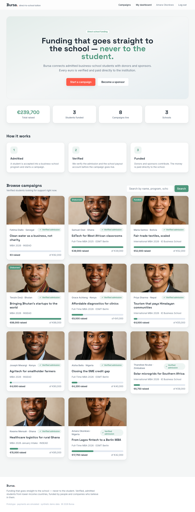
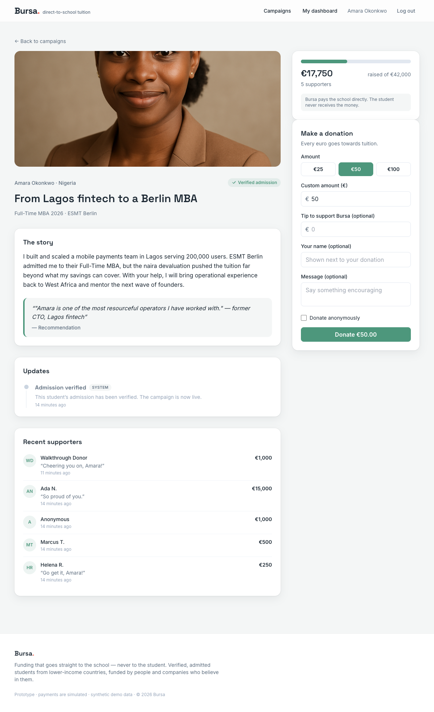
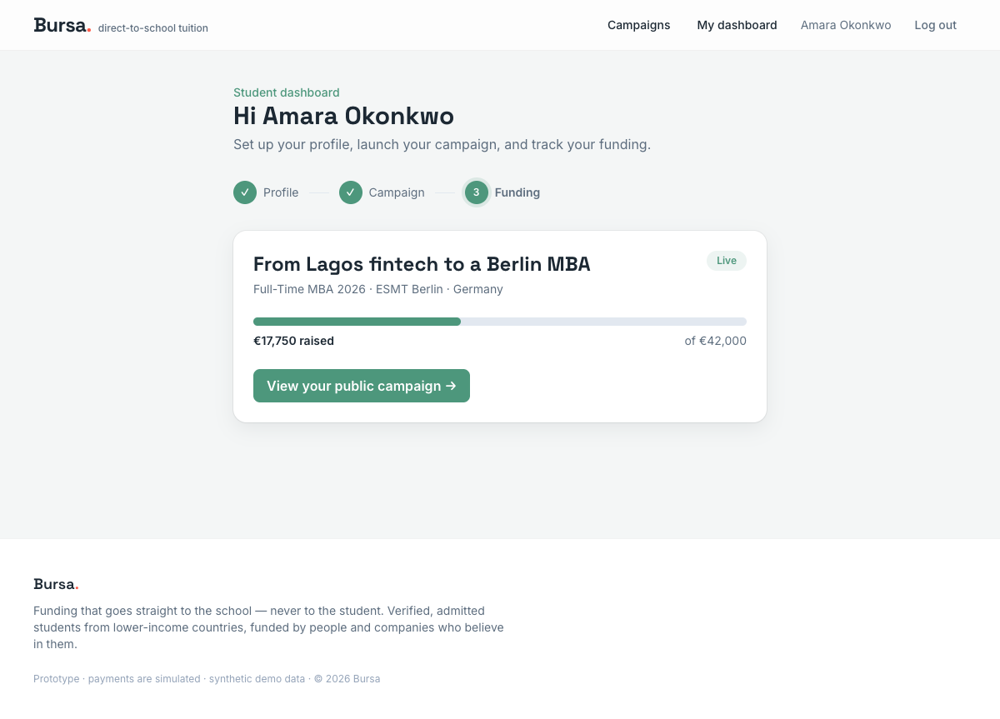
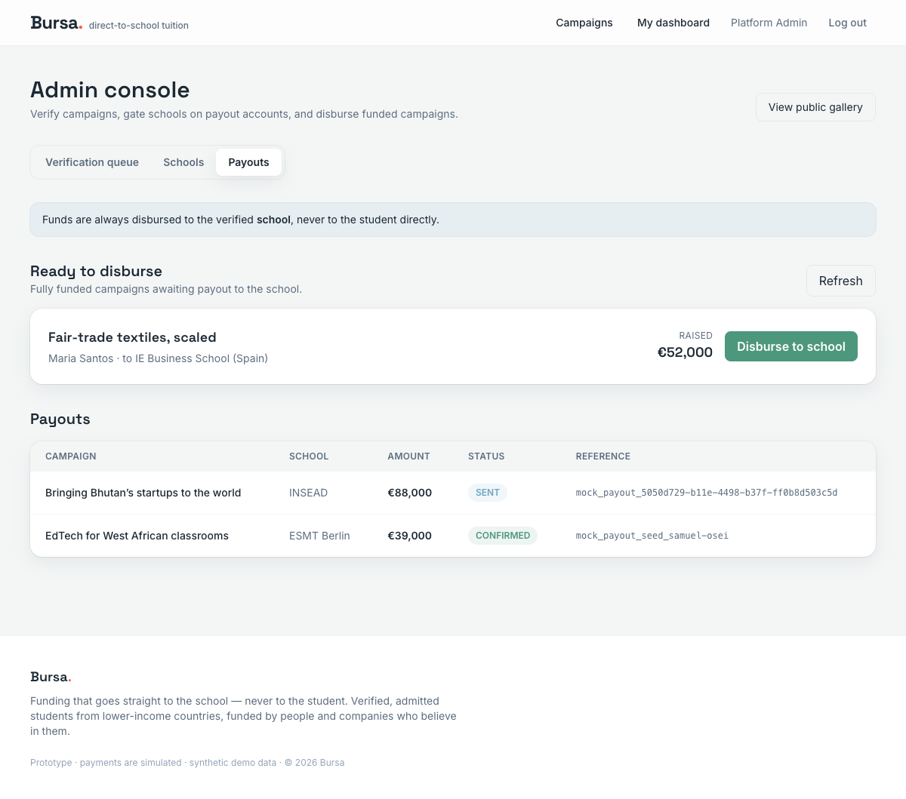

# Bursa - Walkthrough (Prototyp)

Das ist der lauffaehige Prototyp von **Bursa**: eine Plattform, auf der verifizierte, an einer
(europaeischen) Business School **angenommene** MBA-Studierende aus einkommensschwachen Laendern
ihre Studiengebuehren ueber Privatspenden (Kreditkarte) und Corporate-Sponsoren (SEPA) sammeln.
Das Geld geht **direkt an die Schule, nie an die Studierenden** - das ist gleichzeitig der
Trust-USP und der rechtliche Schutzwall (siehe Marktrecherche, Abschnitt 7 und 11).

> Name "Bursa" = aus der Recherche (kurz, international, von "bursary/Bursar" - die Stelle, an die
> direkt ausgezahlt wird). Claim: *"Funding that goes straight to the school - never to the student."*

## In 60 Sekunden starten

```bash
cd ~/dev/se_projects/fundingApp
npm run db:up          # Postgres via Docker (Port 5433)
npm run install:all    # Deps + legt apps/api/.env aus .env.example an (nur 1. Mal)
npm run prisma:migrate # Schema
npm run seed           # synthetische Daten + KI-Profilbilder (DALL-E / gpt-image-1)
npm run dev            # API :3000 + Web :4200
```

Dann **http://localhost:4200** oeffnen.

**Demo-Accounts** (Passwort `bursa1234`): `admin@bursa.test`, `sponsor@acme.test`,
`donor@bursa.test`, `amara@bursa.test`.

## Was funktioniert (alles end-to-end live getestet)

### 1. Oeffentliche Gallery + Spende (Kreditkarte)

Die Startseite zeigt Hero, Live-Statistiken und die verifizierten Kampagnen (mit echten,
KI-generierten Profilbildern). Nur Kampagnen mit verifizierter Zulassung sind sichtbar.



Auf einer Kampagnenseite kann jeder ohne Account per Karte spenden (Mock-Payment). Der
Fortschrittsbalken, die gesammelte Summe und die Spenderliste aktualisieren sich sofort.



### 2. Studierenden-Onboarding

Studierende registrieren sich, bauen ihr Story-Profil, erstellen eine Kampagne (Schule, Programm,
Ziel) und reichen sie zur Verifizierung ein. Das Dashboard zeigt den Fortschritt (Profil →
Kampagne → Funding) und den Status.



### 3. Admin-Verifizierung (Trust-Gate)

Ein Admin sieht die Verifizierungs-Queue, prueft die Zulassung und schaltet die Kampagne live
(sie bekommt das "Verified admission"-Badge und erscheint in der Gallery). Schulen muessen ein
verifiziertes Auszahlungskonto haben, bevor eine Kampagne live gehen darf.

### 4. Direktauszahlung an die Schule (der USP)

Ist eine Kampagne voll finanziert, zahlt der Admin **direkt an die verifizierte Schule** aus.
Die Auszahlung wird mit Betrag, Schule, Referenz und Status erfasst - **es gibt keinen Code-Pfad,
der je einen Studierenden auszahlt**.



### 5. Corporate-Sponsoren (SEPA)

Sponsoren legen ein Firmenprofil an, sehen ihr Impact-Dashboard (committetes Volumen, gefoerderte
Studierende) und koennen pro Spende eine Zuwendungsbestaetigung abrufen. Corporate-Pledges laufen
auf der Kampagnenseite per SEPA (Mock).

## Bewusste Grenzen des Prototyps

- **Payments sind gemockt** hinter einer sauberen `PaymentProvider`-Abstraktion. Ein echter
  Anbieter (Stripe Connect, Mangopay, …) ist 1:1 austauschbar, ohne Domain-Code zu aendern.
  Mock-Detail: Betraege, deren letzte zwei Cent-Stellen `13` sind (z.B. `…,13 EUR`), schlagen
  deterministisch fehl - so ist der Fehlerpfad demonstrierbar.
- **Eine Waehrung** (EUR, in Cent gespeichert). **Eine Kampagne pro Studierendem.**
- Rechtskonstrukt (gGmbH/Stiftung), echte Steuerbelege und grenzueberschreitende Auszahlung sind
  symbolisch modelliert, nicht real.
- Seed-Daten und Gesichter sind **vollstaendig synthetisch** (kein echter Personenbezug).

## Architektur (kurz)

- **Frontend:** Angular 20 (standalone, Signals) + Tailwind, `apps/web`.
- **Backend:** NestJS 11 + Prisma 6 + PostgreSQL 16, `apps/api`.
- **Module:** auth, schools, students, campaigns, donations, sponsors, payouts, admin -
  plus `payments` (Provider-Abstraktion) und `common` (Response-Envelope, Exception-Filter,
  Rollen-Guard).
- **Spec-Driven:** der gesamte Build lief ueber das **spec-kit**-Framework. Alle Artefakte unter
  `specs/001-bursa-funding-platform/` (spec, plan, data-model, contracts, tasks) und die
  `constitution` unter `.specify/memory/`.

## Wo finde ich was?

| Thema | Pfad |
|---|---|
| Marktrecherche (DE, 12 Abschnitte) | `09_Product_Ideas/0911_FundingApp/260626_FundingApp_Marktrecherche.md` (OneDrive) |
| Spec-Kit-Artefakte | `specs/001-bursa-funding-platform/` |
| Constitution | `.specify/memory/constitution.md` |
| Entscheidungs-/Nacht-Log | `docs/ORCHESTRATION.md` |
| API-Doku (Swagger) | `http://localhost:3000/api/docs` (wenn API laeuft) |

## Naechste sinnvolle Schritte

1. Echte Payments: Stripe-Test-Keys in `apps/api/.env`, `MockPaymentProvider` durch einen
   Stripe-Connect-Adapter ersetzen (gleiches Interface).
2. SEPA-Pledge-Flow auf der Kampagnenseite fuer Sponsoren visuell ausbauen.
3. Echte Dokument-Verifizierung (Upload Zulassungsbescheid) statt symbolischer Referenz.
4. Deployment (z.B. fritzflowVPS-Muster: Docker + Traefik) fuer eine klickbare Live-URL.
